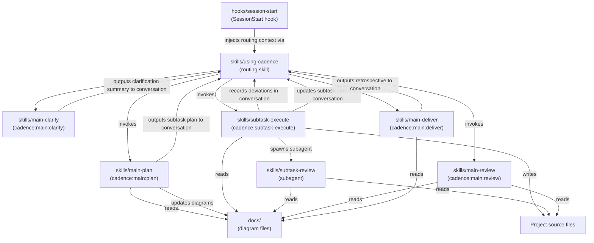

# cadence Plugin — Module Architecture

> **Type**: Architecture
> **Last Updated**: 2026-04-18
> **Covers**: Internal component layout of the cadence plugin and their dependencies

## Diagram

## Key Decisions

- Skills are instruction files, not executable code — Claude interprets them at runtime
- `using-cadence` is the single entry point — it detects feature tasks and routes to the correct phase automatically
- `cadence:subtask-execute` never modifies `flow-*.md` or `arch-*.md` — deviations are recorded in the conversation
- `cadence:subtask-review` is a read-only subagent — it never writes files
- Workflow state (subtask plan, deviations, retrospective) lives in the conversation context — Cadence is session-scoped

## Notes

- `hooks/run-hook.cmd` and `hooks/hooks.json` wire the SessionStart hook into Claude Code
- Plugin metadata lives in `.claude-plugin/` (not shown — not part of the Cadence workflow)
