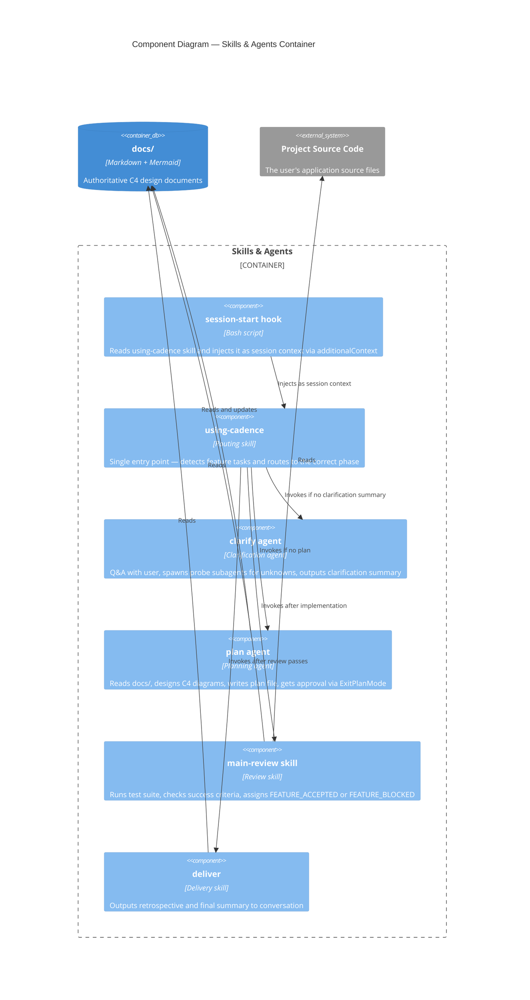

# cadence Plugin — Components

> **Type**: C4 Component
> **Last Updated**: 2026-04-19
> **Covers**: Internal components of the Skills & Agents container

## Diagram

## Key Decisions

- `using-cadence` is the single entry point — all routing decisions live here, not in individual agents
- Workflow state (clarification summary, plan approval, deviations) lives in conversation context — Cadence is session-scoped
- `plan` is the only component that writes to `docs/` — other components read only

## Notes

- See `c4-containers.md` for the container-level view
- See `c4-seq-execution.md` for the runtime interaction sequence
- `hooks/run-hook.cmd` and `hooks/hooks.json` wire the SessionStart hook into Claude Code
