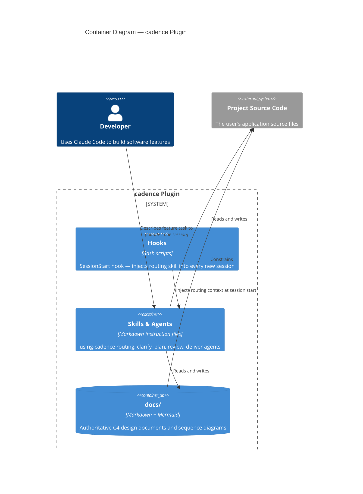

# cadence Plugin — Containers

> **Type**: C4 Container
> **Last Updated**: 2026-04-19
> **Covers**: Internal deployable/runnable units of the cadence plugin

## Diagram

## Key Decisions

- Skills and agents are Markdown instruction files interpreted by Claude at runtime — not executable code
- `docs/` acts as a database container: it persists design state across sessions
- The hooks container has no logic — it only bootstraps the routing skill at session start

## Notes

- See `c4-context.md` for the system boundary view
- See `c4-component-plugin.md` for internal components within the Skills & Agents container
- See `c4-seq-execution.md` for how these containers interact at runtime
