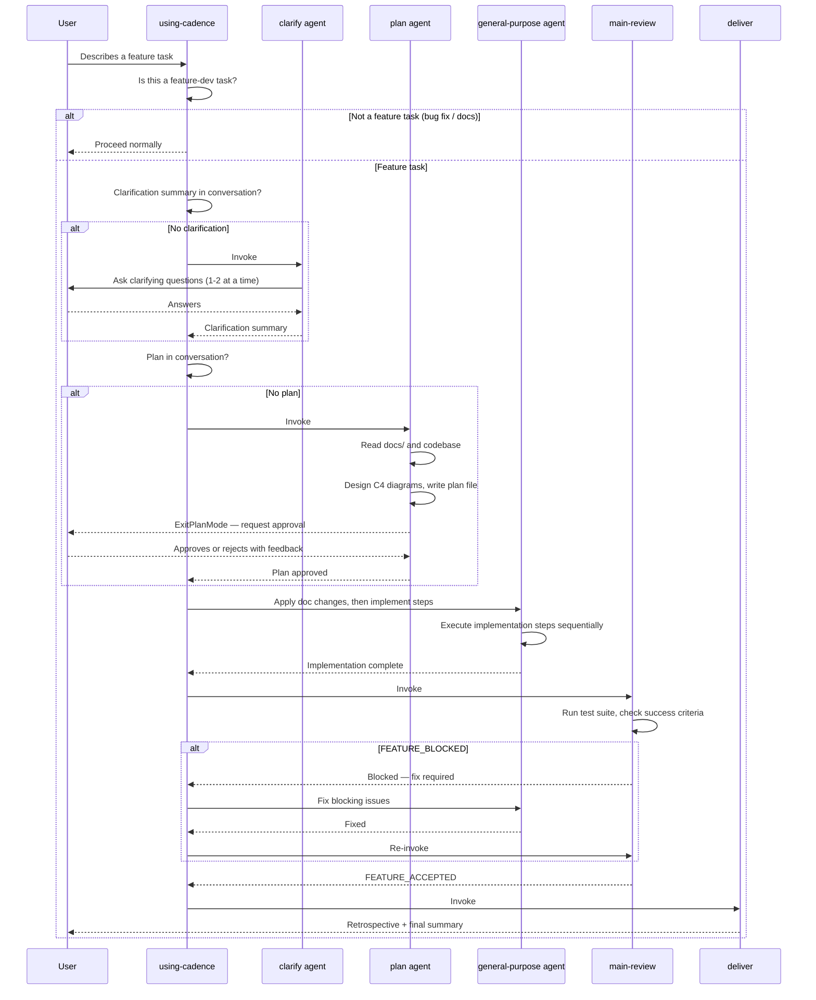

# cadence Skill Execution Flow

> **Type**: Sequence
> **Last Updated**: 2026-04-19
> **Covers**: End-to-end flow from user describing a feature to delivery

## Diagram

## Key Decisions

- Clarification and plan both live in conversation context — Cadence is session-scoped, not persisted across sessions
- `plan` agent uses `EnterPlanMode`/`ExitPlanMode` as the user approval gate — no code is written until the user approves
- `main-review` runs the full test suite as part of end-to-end acceptance
- Deviations discovered during implementation are recorded in conversation, not silently applied to diagrams

## Notes

- Cross-reference: `c4-component-plugin.md` shows which files implement each component in this sequence
- Cross-reference: `c4-containers.md` shows the container-level structure these components belong to
- SessionStart hook injects Cadence routing guidance at the start of each session
