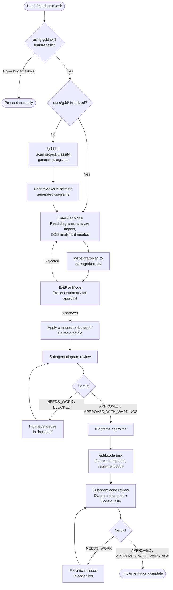

# GDD Command Execution Flow

> **Type**: Flow
> **Last Updated**: 2026-04-07
> **Covers**: End-to-end flow from user describing a task to diagrams and code being approved

## Diagram

## Key Decisions

- The `using-gdd` skill invokes `gdd:plan` directly — the user does not need to type `/gdd:plan`
- `/gdd:plan` uses `EnterPlanMode`/`ExitPlanMode` as the user approval gate — the draft file bridges plan mode to execution mode
- The draft file holds the full Before/After diagram diffs; `ExitPlanMode` presents only a human-readable summary
- Both plan and code phases use a subagent fix-and-retry loop to self-heal critical issues
- Bug fixes and non-feature tasks are caught early by `using-gdd` and bypass the GDD flow entirely
- Deviations discovered during coding are recorded in `docs/gdd/drafts/` rather than silently applied

## Notes

- Cross-reference: `arch-modules.md` shows which files implement each step
- The `using-gdd` skill handles routing logic and invokes `gdd:plan` automatically for feature tasks
- SessionStart hook injects GDD routing guidance at the start of each session
