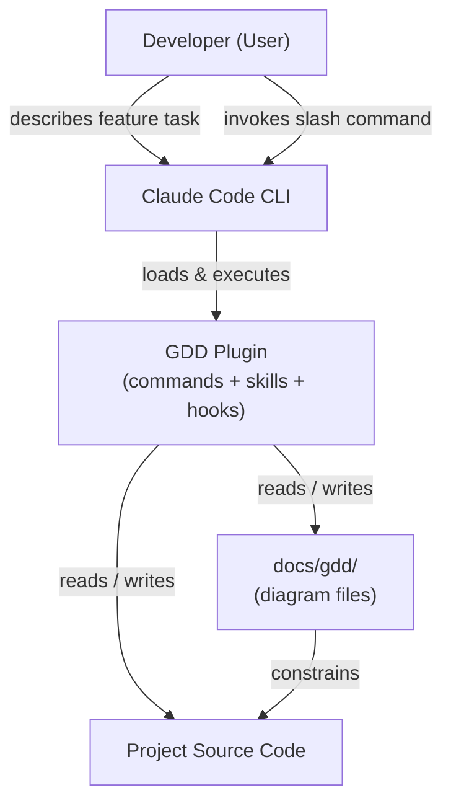

# GDD Plugin — System Overview

> **Type**: Overview
> **Last Updated**: 2026-04-07
> **Covers**: System boundary and external actors for the Graph Driven Development Claude Code plugin

## Diagram

## Key Decisions

- The plugin has no runtime server — it is a set of instruction files interpreted by Claude Code
- `docs/gdd/` is the authoritative source of truth; code must conform to diagrams, not the reverse
- The plugin operates on the user's project directory, not on its own source

## Notes

- See `flow-execution.md` for the automatic skill invocation workflow
- See `arch-modules.md` for internal plugin component layout
