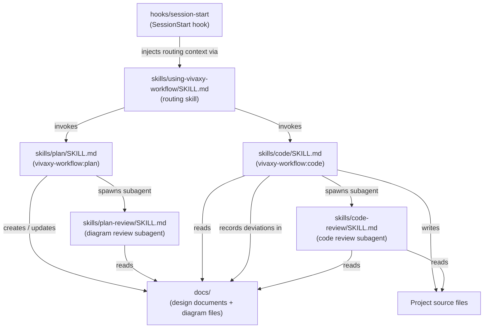

# vivaxy-workflow Plugin — Module Architecture

> **Type**: Architecture
> **Last Updated**: 2026-04-07
> **Covers**: Internal component layout of the vivaxy-workflow plugin and their dependencies

## Diagram

## Key Decisions

- Skills are instruction files, not executable code — Claude interprets them at runtime
- `using-vivaxy-workflow` skill is the single entry point — it detects feature tasks and invokes the appropriate skill automatically
- `vivaxy-workflow:plan` writes documents and diagrams; `vivaxy-workflow:code` never writes docs/diagrams (except deviation records)
- Review skills (`plan-review`, `code-review`) are read-only subagents — they never write files
- Dependency direction: code depends on documents and diagrams, documents and diagrams do not depend on code

## Notes

- Dependency direction: arrows point from dependent to dependency
- `hooks/run-hook.cmd` and `hooks/hooks.json` wire the SessionStart hook into Claude Code
- Plugin metadata lives in `.claude-plugin/` (not shown — not part of the vivaxy Workflow workflow)
