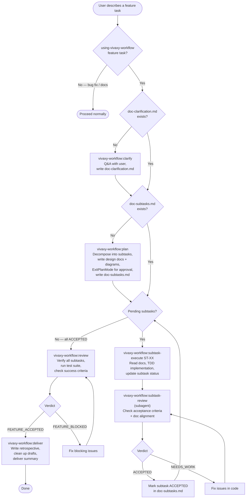

# vivaxy-workflow Skill Execution Flow

> **Type**: Flow
> **Last Updated**: 2026-04-18
> **Covers**: End-to-end flow from user describing a feature to delivery

## Diagram

## Key Decisions

- Workflow state is detected from `docs/` file presence — the routing skill resumes from the correct phase automatically
- `vivaxy-workflow:plan` uses `EnterPlanMode`/`ExitPlanMode` as the user approval gate for the subtask plan
- Each subtask is independently executed and accepted before moving to the next
- `vivaxy-workflow:subtask-review` is a read-only subagent — it never writes files
- `vivaxy-workflow:review` runs the full test suite as part of end-to-end acceptance
- Deviations discovered during execution are recorded in `docs/drafts/` rather than silently modifying diagrams

## Notes

- Cross-reference: `arch-modules.md` shows which files implement each step
- SessionStart hook injects vivaxy Workflow routing guidance at the start of each session
