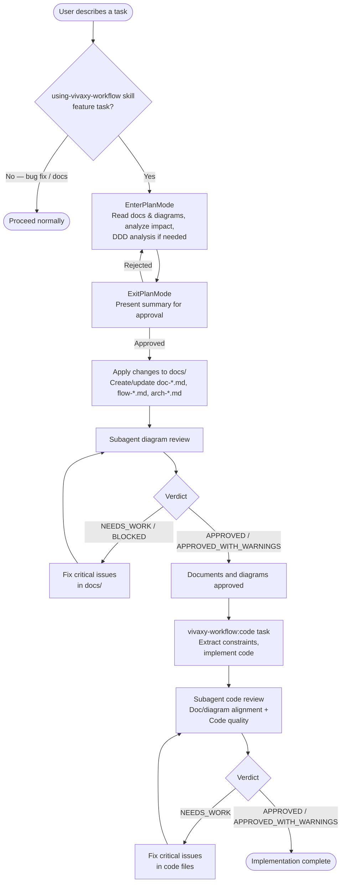

# vivaxy-workflow Skill Execution Flow

> **Type**: Flow
> **Last Updated**: 2026-04-07
> **Covers**: End-to-end flow from user describing a task to documents, diagrams, and code being approved

## Diagram

## Key Decisions

- The `using-vivaxy-workflow` skill invokes `vivaxy-workflow:plan` directly — the user does not need to type a command
- `vivaxy-workflow:plan` uses `EnterPlanMode`/`ExitPlanMode` as the user approval gate
- Both plan and code phases use a subagent fix-and-retry loop to self-heal critical issues
- Bug fixes and non-feature tasks are caught early by `using-vivaxy-workflow` and bypass the vivaxy Workflow entirely
- Deviations discovered during coding are recorded in `docs/drafts/` rather than silently applied
- `docs/` is auto-initialized if missing — the plan step creates initial documents and diagrams as needed

## Notes

- Cross-reference: `arch-modules.md` shows which files implement each step
- The `using-vivaxy-workflow` skill handles routing logic and invokes `vivaxy-workflow:plan` automatically for feature tasks
- SessionStart hook injects vivaxy Workflow routing guidance at the start of each session
